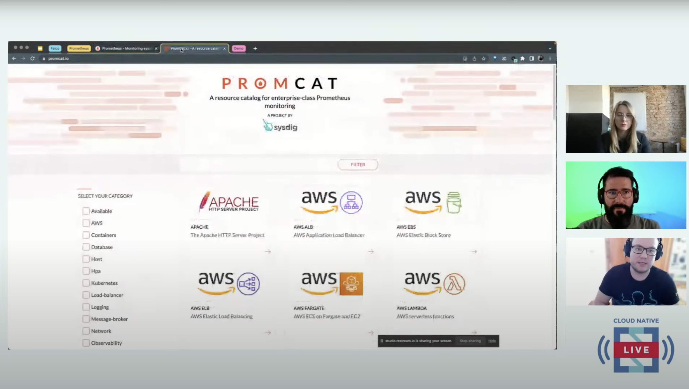

# Prometheus + Falco: The swiss army knife for SREs



These are the configurations used in [this Cloud Native Live talk](https://www.youtube.com/live/AeeXSm0Zzfk?feature=share)

## Runbook

You can install Prometheus and Falco using helmfile. There are four steps in case you wan't to do it in the same order we did in the talk.

```
helmfile sync
```

You can have the last version of the cluster and falco rules just by using the `helmfile-step-4.yaml`


```
helmfile sync -f helmfile-step-4.yaml
```

To install the apps you can apply the yaml files in the `apps` directory. This will install a nginx sample app, a ntpd server example app and the crypto-miner-fake app we used to trigger Falco events.


```
k apply -f apps
```

Other useful scripts are

- `forward-ports.sh` to access to the apps from your local machine:
  - [Prometheus](http://localhost:9090)
  - [Alert Manager](http://localhost:9093)
  - [Grafana](http://localhost:3000)
  - [Falco Sidekick UI](http://localhost:2802)
- `get-grafana-creds.sh` to get Grafana credentials for the UI.

Also, you can import the dashboard we used in the talk in Grafana. It's in the `dashboards` directory. 

## References

- [How to monitor nginx in Kubernetes with Prometheus](https://dev.to/eckelon/how-to-monitor-nginx-in-kubernetes-with-prometheus-j5f)
- [Getting started with PromQL](https://dev.to/eckelon/getting-started-with-promql-includes-cheatsheet-3a1d)
- [PromCat.io - The Easy Button for Prometheus](https://promcat.io)
- [Try Falco](https://falco.org/docs/getting-started/try-falco/)
- [Extend Falco outputs with falcosidekick](https://falco.org/blog/extend-falco-outputs-with-falcosidekick/)

